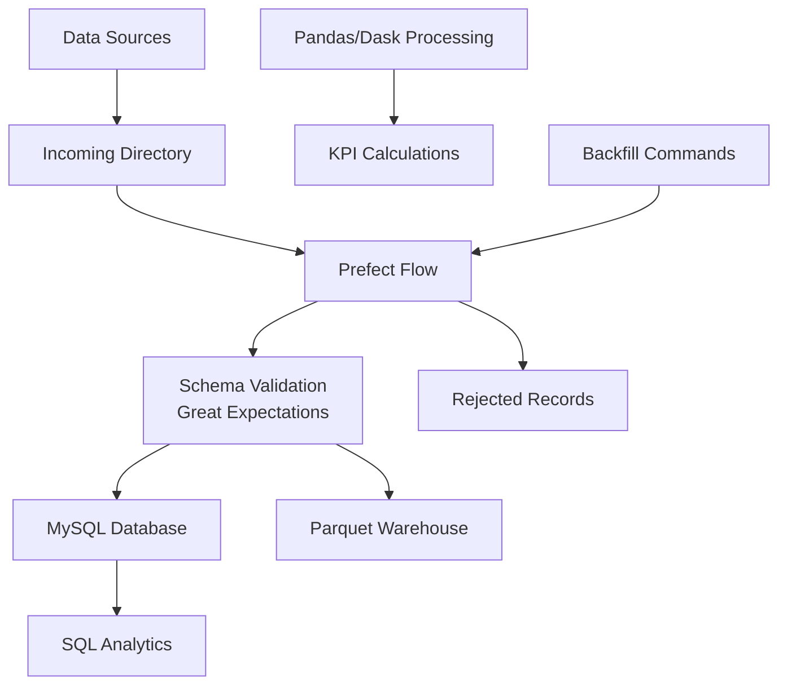

# Akasa Air – Data Engineering Task

A complete, production-ready data engineering solution that processes and analyzes customer and order data from multiple sources (CSV and XML) using both **SQL-based (MySQL + SQLAlchemy ORM)** and **in-memory (Pandas)** approaches.

## Table of Contents

- [Overview](#overview)
- [Features](#features)
- [Architecture](#architecture)
- [Project Structure](#project-structure)
- [Prerequisites](#prerequisites)
- [Installation](#installation)
- [Configuration](#configuration)
- [Usage](#usage)
- [KPIs Implemented](#kpis-implemented)
- [Example Outputs](#example-outputs)
- [Best Practices](#best-practices)
- [Troubleshooting](#troubleshooting)
- [Contributing](#contributing)
- [License](#license)

## Overview

This project demonstrates advanced data engineering capabilities by implementing a dual-approach analytics pipeline:

1. **Table-Based Approach**: Uses MySQL database with SQLAlchemy ORM for persistent storage and SQL-based analytics
2. **In-Memory Approach**: Uses Pandas DataFrames for fast, memory-efficient data processing

Both approaches produce identical KPIs, allowing for comparison and validation of results.

## Features

- **Multi-Source Data Ingestion**: Parse and load data from CSV and XML files
- **Data Quality & Validation**: Comprehensive data cleaning, normalization, and validation
- **Dual Processing Pipelines**: Both SQL and Pandas implementations for flexibility
- **Production-Ready Code**: Error handling, logging, security best practices
- **Modular Design**: Clean separation of concerns with reusable components
- **Type Safety**: Type hints throughout the codebase
- **Comprehensive Documentation**: Detailed docstrings and comments
- **Orchestration**: Prefect-based workflow orchestration with incremental loads
- **Data Quality**: Great Expectations for data validation and profiling
- **Performance Optimization**: Database indexing and query optimization
- **Scalability**: Dask support for large-scale data processing
- **Testing**: Pytest unit and integration tests
- **CI/CD**: GitHub Actions workflow for automated testing and deployment
- **Containerization**: Docker and Docker Compose for easy deployment
- **Cloud-Ready**: S3-compatible storage abstraction

## Architecture

### System Architecture



### Data Flow

```
CSV/XML Files
     ↓
Data Validation & Cleaning (Great Expectations)
     ↓
     ├─→ Incremental Load to MySQL (with indexes)
     │
     ├─→ Parquet Data Lake (partitioned by date)
     │
     └─→ In-Memory Processing (Pandas/Dask)
                ↓
         KPI Calculations
                ↓
         ┌───────────────┐
         │   Outputs     │
         ├───────────────┤
         │ JSON Reports  │
         │ CSV Exports   │
         │ Data Docs     │
         └───────────────┘
```

### Environments

1. **Local Development**: Docker Compose with MySQL and Prefect
2. **CI Environment**: GitHub Actions with pytest and linting
3. **Production**: Cloud-ready with S3 and container orchestration

## Project Structure

```
AkasaAir-DataEngineer-Task1/
├── README.md                       # Project documentation
├── requirements.txt                # Python dependencies
├── .env.example                    # Environment variables template
├── .github/workflows/             # CI/CD workflows
├── data/                          # Data directory
│   ├── customers.csv              # Customer data (CSV format)
│   ├── orders.xml                 # Orders data (XML format)
│   ├── incoming/                  # New data drops
│   ├── warehouse/                 # Parquet data lake
│   └── rejects/                   # Failed records
├── outputs/                       # Generated reports and results
├── reports/                       # Data quality reports and docs
├── flows/                         # Prefect orchestration flows
├── docs/                          # Documentation and performance notes
├── tests/                         # Unit and integration tests
├── src/                           # Source code
│   ├── __init__.py
│   ├── main.py                    # Main entry point
│   ├── config/                    # Configuration management
│   │   ├── __init__.py
│   │   └── config.py              # Environment and database config
│   ├── database/                  # Database layer
│   │   ├── __init__.py
│   │   ├── db_setup.py            # SQLAlchemy models and setup
│   │   ├── load_data.py           # Data loading from CSV/XML
│   │   └── migrations.py          # Database migrations
│   ├── processing/                # Analytics processing
│   │   ├── __init__.py
│   │   ├── sql_queries.py         # SQL-based KPI calculations
│   │   ├── pandas_processing.py  # Pandas-based KPI calculations
│   │   └── dask_processing.py    # Dask-based KPI calculations
│   └── utils/                     # Utility modules
│       ├── __init__.py
│       ├── logger.py              # Centralized logging
│       ├── helpers.py             # Data cleaning helpers
│       └── storage.py             # Storage abstraction
├── Dockerfile                     # Container definition
├── docker-compose.yml             # Multi-container setup
├── Makefile                       # Common commands
└── FUTURE_IMPROVEMENTS.md         # Roadmap and next steps
```

## Prerequisites

- **Python**: 3.8 or higher
- **MySQL**: 5.7 or higher (or MariaDB 10.3+)
- **Docker**: For containerized deployment (optional)
- **Operating System**: macOS, Linux, or Windows

## Installation

### 1. Clone or Download the Project

```bash
cd /Users/siv3sh/Downloads/AkasaAir-DataEngineer-Task1
```

### 2. Create a Virtual Environment

```bash
python3 -m venv venv
source venv/bin/activate  # On Windows: venv\Scripts\activate
```

### 3. Install Dependencies

```bash
pip install -r requirements.txt
```

### 4. Set Up MySQL Database

Create a MySQL database for the project:

```sql
CREATE DATABASE akasa_air_db CHARACTER SET utf8mb4 COLLATE utf8mb4_unicode_ci;
```

Create a MySQL user (optional but recommended):

```sql
CREATE USER 'akasa_user'@'localhost' IDENTIFIED BY 'your_secure_password';
GRANT ALL PRIVILEGES ON akasa_air_db.* TO 'akasa_user'@'localhost';
FLUSH PRIVILEGES;
```

## Configuration

### 1. Create Environment File

Copy the example environment file and configure it:

```bash
cp .env.example .env
```

### 2. Edit .env File

Update the `.env` file with your database credentials:

```env
# Database Configuration
DB_HOST=localhost
DB_PORT=3306
DB_USER=akasa_user
DB_PASSWORD=your_secure_password
DB_NAME=akasa_air_db

# Data Paths (optional - defaults are provided)
CUSTOMERS_CSV_PATH=data/customers.csv
ORDERS_XML_PATH=data/orders.xml

# Output Directory (optional - defaults to 'outputs')
OUTPUT_DIR=outputs

# Optional AWS Configuration
AWS_ACCESS_KEY_ID=your_access_key
AWS_SECRET_ACCESS_KEY=your_secret_key
AWS_REGION=us-east-1
S3_BUCKET=your-bucket-name
```

**Security Note**: Never commit the `.env` file to version control. It's already included in `.gitignore`.

## Usage

### Run the Complete Pipeline

Execute the main script to run both SQL and Pandas approaches:

```bash
python -m src.main
```

Or from the project root:

```bash
python src/main.py
```

### Run with Specific Engine

```bash
# Run with pandas engine (default)
python -m src.main --engine pandas

# Run with dask engine for large datasets
python -m src.main --engine dask

# Run with both engines
python -m src.main --engine both
```

### Run Daily Ingestion Flow

```bash
python -m flows.daily_ingestion
```

### Run Backfill for Date Range

```bash
python -m flows.daily_ingestion --backfill-start 2024-01-01 --backfill-end 2024-01-31
```

### Containerized Deployment

```bash
# Start all services
make up

# Seed database
make seed

# Run daily flow
make flow

# Stop services
make down
```

### Run Tests

```bash
# Run unit tests
pytest tests/

# Run with coverage
pytest tests/ --cov=src --cov-report=html
```

### Run Database Migrations

```bash
python -m src.database.migrations
```

### What Happens When You Run

1. **Database Initialization**: Connects to MySQL and creates/resets tables
2. **Data Loading**: Parses CSV and XML files, validates data, and loads into database
3. **SQL Analytics**: Calculates all KPIs using SQL queries
4. **Pandas/Dask Analytics**: Calculates all KPIs using in-memory processing
5. **Output Generation**: Saves results to `outputs/` directory in JSON and CSV formats
6. **Console Display**: Shows formatted tables of all KPIs

### Expected Output

```
================================================================================
  AKASA AIR - DATA ENGINEERING TASK
================================================================================

Processing customer and order data using both SQL and Pandas approaches...

================================================================================
  SQL-BASED ANALYTICS APPROACH
================================================================================

Data Load Summary:
  - Customers loaded: 20
  - Orders loaded: 28

================================================================================
  KPI 1: Repeat Customers
================================================================================

Repeat Customers (SQL)
----------------------
+---------------+-------------------+----------------+----------+---------------+
| customer_id   | customer_name     | mobile_number  | region   | order_count   |
+===============+===================+================+==========+===============+
| 1             | Amit Sharma       | 9876543210     | North    | 3             |
| 2             | Priya Patel       | 9876543211     | West     | 3             |
| 6             | Anjali Desai      | 9876543215     | West     | 3             |
| 7             | Karthik Menon     | 9876543216     | South    | 3             |
+---------------+-------------------+----------------+----------+---------------+

... (additional KPIs displayed)

================================================================================
  ANALYSIS COMPLETE
================================================================================

All KPIs have been calculated using both approaches.
Results saved to: outputs

Thank you for using Akasa Air Data Engineering Solution!
```

## KPIs Implemented

### 1. Repeat Customers

**Definition**: Customers who have placed more than one order.

**SQL Implementation**: Uses `JOIN`, `GROUP BY`, and `HAVING` clauses
**Pandas Implementation**: Uses `groupby()` and `merge()` operations
**Dask Implementation**: Uses distributed `groupby()` and `merge()` operations

**Columns**:
- Customer ID
- Customer Name
- Mobile Number
- Region
- Order Count

### 2. Monthly Order Trends

**Definition**: Total number of orders and revenue per month.

**SQL Implementation**: Uses date functions (`YEAR()`, `MONTH()`) and aggregations
**Pandas Implementation**: Uses datetime extraction and `groupby()` with `agg()`
**Dask Implementation**: Uses distributed datetime operations and aggregations

**Columns**:
- Year
- Month
- Order Count
- Total Revenue

### 3. Regional Revenue

**Definition**: Total revenue, customer count, and order metrics grouped by region.

**SQL Implementation**: Uses `JOIN` with regional grouping
**Pandas Implementation**: Uses `merge()` and multi-column aggregations
**Dask Implementation**: Uses distributed merge and aggregation operations

**Columns**:
- Region
- Customer Count
- Order Count
- Total Revenue
- Average Order Value

### 4. Top Customers by Spend (Last 30 Days)

**Definition**: Top 10 customers ranked by total spending in the last 30 days.

**SQL Implementation**: Uses date filtering and `LIMIT` clause
**Pandas Implementation**: Uses datetime filtering and `head()` with sorting
**Dask Implementation**: Uses distributed datetime filtering and sorting

**Columns**:
- Customer ID
- Customer Name
- Mobile Number
- Region
- Order Count
- Total Spent
- Average Order Value
- Last Order Date

## Example Outputs

### Output Files Generated

The application generates the following files in the `outputs/` directory:

**SQL Approach (JSON format)**:
- `sql_repeat_customers.json`
- `sql_monthly_trends.json`
- `sql_regional_revenue.json`
- `sql_top_spenders.json`

**Pandas Approach (CSV format)**:
- `pandas_repeat_customers.csv`
- `pandas_monthly_trends.csv`
- `pandas_regional_revenue.csv`
- `pandas_top_spenders.csv`

**Dask Approach (CSV format)**:
- `dask_repeat_customers.csv`
- `dask_monthly_trends.csv`
- `dask_regional_revenue.csv`
- `dask_top_spenders.csv`

### Sample Output: Regional Revenue

```json
[
  {
    "region": "South",
    "customer_count": 6,
    "order_count": 10,
    "total_revenue": 59735.84,
    "avg_order_value": 5973.58
  },
  {
    "region": "West",
    "customer_count": 4,
    "order_count": 7,
    "total_revenue": 33068.17,
    "avg_order_value": 4724.02
  }
]
```

## Best Practices

### Security

- ✅ No hardcoded credentials (uses `.env` file)
- ✅ Parameterized queries via SQLAlchemy ORM (prevents SQL injection)
- ✅ Password handling via environment variables
- ✅ Optional AWS Secrets Manager integration

### Code Quality

- ✅ Type hints throughout
- ✅ Comprehensive docstrings
- ✅ PEP 8 compliant formatting
- ✅ Modular, reusable functions
- ✅ Error handling and logging

### Data Quality

- ✅ Date normalization (handles multiple formats)
- ✅ Mobile number validation and cleaning
- ✅ Missing value handling
- ✅ Data quality issue logging
- ✅ Transaction management for database operations
- ✅ Great Expectations for validation

### Performance

- ✅ Database indexes on frequently queried columns
- ✅ Connection pooling for database
- ✅ Efficient Pandas operations (vectorization)
- ✅ Batch inserts for data loading
- ✅ Dask support for large datasets
- ✅ Query optimization with EXPLAIN analysis

### Scalability

- ✅ Containerized deployment with Docker
- ✅ Cloud-ready with S3 abstraction
- ✅ Horizontal scaling with Dask
- ✅ Incremental processing for large datasets

## Troubleshooting

### Database Connection Issues

**Error**: `Can't connect to MySQL server`

**Solution**: 
1. Verify MySQL is running: `mysql.server status` (macOS) or `sudo service mysql status` (Linux)
2. Check database credentials in `.env` file
3. Ensure the database exists: `SHOW DATABASES;`

### Import Errors

**Error**: `ModuleNotFoundError: No module named 'src'`

**Solution**: Run from the project root directory using `python -m src.main`

### Data File Not Found

**Error**: `FileNotFoundError: CSV file not found`

**Solution**: Ensure `data/customers.csv` and `data/orders.xml` exist in the project directory

### Docker Issues

**Error**: `Cannot connect to the Docker daemon`

**Solution**: Ensure Docker is running and you have proper permissions

### Prefect Flow Issues

**Error**: `ModuleNotFoundError` when running flows

**Solution**: Run flows using module syntax: `python -m flows.daily_ingestion`

## Contributing

This is a technical assessment project. For production use:

1. Add unit tests (pytest)
2. Add integration tests
3. Implement CI/CD pipeline
4. Add monitoring and alerting
5. Add data versioning
6. Implement incremental data loading

## License

This project is created for the Akasa Air Data Engineering assessment.

## Contact

For questions or issues, please contact the development team.

---

**Built with**: Python 3.8+, MySQL, SQLAlchemy, Pandas, Prefect, Great Expectations, Dask
**Last Updated**: November 2024